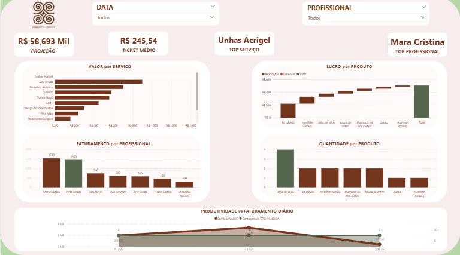

# analise-performance-salao-beleza

Esse é meu primeiro projeto de Análise de dados, realizado como conclusão do curso de Power B.I módulo 1, desenvolvi dados ficticios na criação de uma planilha no Excel atentando-me para cada detalhe relevante buscando atingir proximidade com um cenário real. 
O desafio central foi unificar duas frentes de receita distintas: a prestação de serviços (mão de obra) e a venda de produtos (varejo) em um único ecossistema visual. 

Esse projeto marca minha transição de carreira após 10 anos trabalhando como trancista, trago de alguma forma minha experiência profissional na industria da beleza para dentro da análise de dados. 

  

